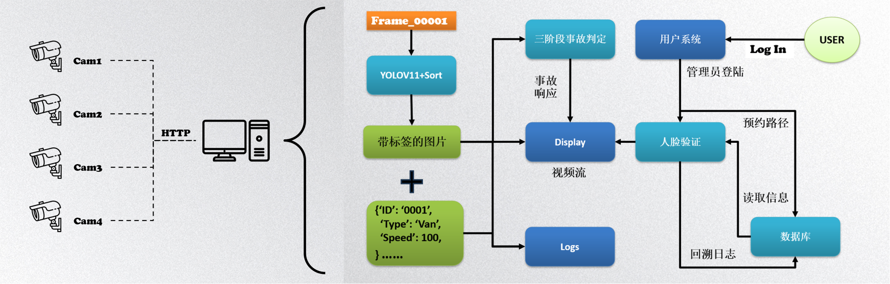

# CPS-ITVDS

English | [中文](./README.zh-CN.md)

Admin platform built with Vue 3 + Vite + TypeScript.

## Introduction

- Project name: CPS-ITVDS
- Positioning: Admin platform and prototype showcase

## Tech Stack

- Vue 3, TypeScript
- Vite 5, UnoCSS
- Pinia, Vue Router 4
- Ant Design Vue 4
- Axios, ECharts, VXE-Table, xlsx, etc.

> Runtime and dependencies are defined in `cps-itvds-admin/package.json`: Node >= 18.12.0, pnpm >= 9.0.2.

## Project Structure

```
CPS-ITVDS/
├─ cps-itvds-admin/   # Frontend app
├─ LICENSE            # MIT license
├─ README.md          # English README (default)
└─ README.zh-CN.md    # Chinese README
```

## Getting Started

1) Environment

- Node.js >= 18.12.0
- pnpm >= 9 (install via corepack or `npm i -g pnpm`)

2) Install & Run (inside the subproject)

```bash
# enter the frontend project
cd cps-itvds-admin

# install deps
pnpm install

# dev server
pnpm serve  # same as pnpm dev

# build
pnpm build

# local preview (after build)
pnpm preview
```

> Visit the address shown in the terminal after startup (Vite default is 5173, subject to actual output).

## Common Scripts (inside `cps-itvds-admin/`)

- `pnpm serve`: start dev server
- `pnpm build`: production build
- `pnpm preview`: preview built assets locally
- `pnpm lint`: lint code
- `pnpm type:check`: type-check via vue-tsc

## Build & Deployment

- Artifacts are in `cps-itvds-admin/dist/`, deployable by any static server (e.g. Nginx).
- For Docker usage, refer to `cps-itvds-admin/README.md` (supports `VG_BASE_URL` to inject backend endpoint).

## Contribution

- Follow commit conventions from Vben Admin (e.g., feat/fix/docs/chore).

## License

- MIT license (for formal purposes). See `LICENSE` in the repository root.

## Thanks

- This project is based on the open-source template [Vue Vben Admin](https://github.com/vbenjs/vue-vben-admin).
